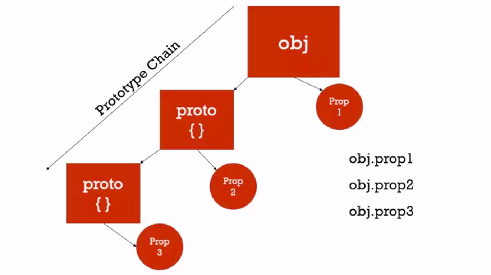

## Classical vs Prototypical Inheritance

Inheritance: One object gets access to the properties and methods of second object.

#### Classical Inheritance:
    It is very verbose and generally not flexible like the one whe implement in C++.

#### Prototype inheritance:
    It is flexible. This happens in JAVASCRIPT.

#### Object Prototype:

Whenever we find any prooperty linked to an object, firstly the engine finds it in the direct level of the object but later it finds it in the subobjects linked through prototype property. 
This is known as prototype chain.



Thus through this way, we can actually call properties linked by prototype chain.

Suppose there is another obj2 with same proto{} which was having Prop2. In that case, obj2.Prop2 returns same memory location as obj.Prop2. It is same.

```
var person={
    firstname: "Generic",
    lastname: "Default",
    getFullname: function(){
        return this.firstname + " " + this.lastname;
    }
}
